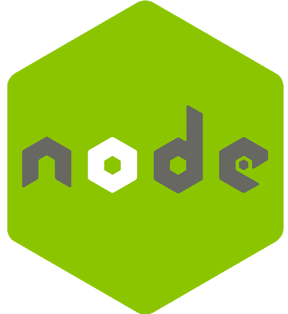

#  Thanks for visiting my Github.
 
 

  

## 📜 About Me

 
I am a Full-Stack Engineer with industry experience in building websites and web applications. Specialist in JS framework. Satisfactory background working with React, Angular, Vue and Node on multiple projects.

I have powerful Front-End experience and am eager to learn more concepts and deep dive into web area.

Detailed-oriented, responsible, committed engineer, With a get-it-done, on-time, and high-quality product spirit. Self-quick learner, self-motivated, and social.

 

🚀  I’m currently learning Full Stack Development. 
💻  I love exploring new tech stack and building cool stuffs. 
💯  Ability to work autonomously and overcome challenges with passion. 
💫  Writing clean, reusable code with strong emphasis on stability and performance. 
📰  Reading & writing tech blogs whenever possible. 
☕  Coffee lover  🕊  love feeding birds. 

## 🛠️ Tech Stack

<code></code>
<code></code>
<code></code>
<code></code>
<code></code>
<code></code>
<code></code>
<code></code>
<code></code>

<code></code>
<code></code>
<code></code>
<code></code>
<code></code>
<code></code>
<code></code>
<code></code>
<code></code>
<code></code>
<code></code>
